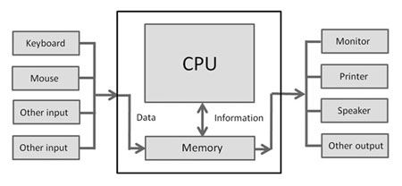

# Let's Learn About Computers


## What is a Computer?

Computers are electronic machines that accept information, process the information according to specific instructions, and provide new information as the result.

*What does that mean??*



Computers can receive information from Mouse, Keyboard, Camera, etc. BUt they don't know how to handle the information intrinsically. You, the *human* must give the computer specific instructions, so they know how to handle the information.

## Giving Instructions to Computers


We communicate with computers through the same tool with which we communicate with other fellow human beings. We use **language**!!

We simply tell computers what to do for us, and they do it for us!


So... If I want an ice-cream, can I just ask my computer to get one for me? Well, yes... and no!

Imagine if you ask your friend to get an ice-cream for you. Imagine if your friend is nice enough to get the ice-cream for you. They will now there are steps to the goal of getting an ice-cream, and they do the steps without you having to tell them what to do. They know they have to do the following and you do not have to tell them about it:

1. Put your Jacket on.
2. Put your shoes on.
3. Tie your shoelaces.
4. Open the door.
5. Step outside.
6. Close the door.
7. Lock the door.
8. Take the stairs
9. Walk down the ally.
10. Get to the grocery store.
11. Buy an ice-cream.

You get the idea. Your friend must perform lots and lots of step before they get the ice-cream to you. You do not need to inform your friend about these steps, they are smart enough to know.

**Computers are not**. You need to give them instructions for every little bit of thing you want them to do. Sounds frustrating! Yes, but with appropriate instructions, you can get the computers to do anything for you!


We give the instructions to computers thorough **programming languages**. We define each and every step very carefully and computers will go through that steps and do what we want from them.

In this workshop, we will teach you about the languages which will help you create your own web pages.

But before that, let's see what is internet, what is this thing called the **world wide web**.


## What is the World Wide Web?


From Wikipedia:

"The World Wide Web (WWW), also called the Web, is an information space where documents and other web resources are identified by Uniform Resource Locators (URLs), interlinked by hypertext links, and accessible via the Internet."

**WHAT??**

In simpler words, World Wide Web is a virtual space where all the computers in the world can communicate with each other and share information with each other.

For example, when you want to Google something, computers do the following:

1. Your computer connects to a computer *running* Google's website somewhere in the world.
2. The Google computer stands-by for the information from your computer
3. Your computer send the *keyword* you want to search to the Google's computer
4. Google's computer processes your request
5. Google's computer shares the result of the search with your computer
6. Your computer receives the information from Google's computer, processes it, and show the result to you.


This is just a start, but we now know a little bit about Internet. It is time to create our own web-pages now!

## Webpages and Computing Languages

When you go to Google's website, you see this:


But, what computers really see is this:


**What does this all mean??** We will teach you to understand! This is not as complicated as it looks, we promise!

This is code, written in HTML. We need to understand what HTML is, and how it works.

# Introduction to HTML


### Activity 1-1
Sometimes it is better to try first and learn afterwards. Follow these steps and by the end of today you will learn the rational behind each.

1. Open your code playground. A code playground is a live environment which continuously interprets your code.

2. On the HTML tab, put the following.

```html
<!DOCTYPE html>
<html>
<head>
  <meta charset="utf-8">
  <title>Title Goes Here</title>
</head>
<body>

  <h1>My name is...</h1>
  <p>I think computers are...</p>

</body>
</html>
```

3. Continue making amendments where you see "...". Try to observe and understand what happens to the outcome when you make certain changes to the code.

## Tags

You just made your first HTML web-page!

Everything in HTML goes inside a tag. Tags are specific instructions given by the user to the interpretation machine. All tags start with a < (left bracket) and a > (right bracket). Stuff like `<!DOCTYPE>`, `<html>`, and `</html>` are some of the tags in the code snippet above.<br>

### Activity 1-2

Try to find the rest of the **tags** with the help of your teammates.

Now that we can identify the tags,let's revisit the code above and try to understand what we did there and learn along the way:

* The `<!DOCTYPE html>` declares that this document is a html document.
* `<html>` and `</html>`mark the beginning and the end of the **HTML element**.

## Elements

`<html>` is called a **start** tag, and `</html>` is called an **end** tag. A html document consists of **elements**. The body that goes between a start tag and an end tag is called an **element** in html. For example, the **HTML element** in the code above consists of everything from the start tag `<html>` to the end tag `</html>`

### Activity 1-3

1. Try to find the rest of the **elements** with the help of your teammates.

You can review some of the most important html tags <a href="htmlcheatsheet.pdf"> here </a>. The document is from the Stanford University.

* **Start tag** `<head>` starts the *head element* and `<!head>` finishes it.
* The author can write the title of the webpage between `<title>` and `</title>` tags.
* The body of the webpage (the *body element*) goes between `<body>` and `</body>`.
* `<h1>` and `</h1>` indicate what goes between is stylistically a header.
* `<p>` and `</p>` mark the beginning and end of a paragraph element.

Before starting the next activity make sure you have reviewed carefully the html sheet <a href="htmlcheatsheet.pdf"> here </a>.

A HTML documented is usually divided up and presented in separate sections. The image below identify some of the most important of these separate sections.


Each of these tags define an independent `element` in the HTML document.

The elements that these tags create are called `semantic elements` because the tags defines the role of their content in the document.

To get a better picture of things imagine if:

1. the content of the walls of your class room (stuff like pictures, graphs, etc.) are in the `semantic element` of ```<wall>```

2. What is on the ground of your classroom (stuff like your chairs, desks, etc.) are in the `semantic element` of ```<ground>```

3. What is on your desks (stuff like your monitor, mouse, keyboard, etc.) are in the `semantic element` of ```<desk>```

We have already used `<p>` and `<h1>`. These are also semantic tags because they define what is the content of your elements. For example, if you are using `<p>` you know what is inside the tags is to be understood as a `paragraph`.

Let's do an activity to get a better understanding of semantic tags.

### Activity 1-4

1. Open your <a href="style.txt"> style file</a> and copy its content into the CSS section of your code playground. This is a code written in CSS. CSS is an exciting tool for adding style to your HTML document. We will learn more on this soon.

2. Copy this code below in the HTML section of your code playground

```html
<!DOCTYPE html>
<html>
  <head>
    <meta charset="utf-8" />
    <title></title>
    <link href="https://fonts.googleapis.com/css?family=Open+Sans|Roboto" rel="stylesheet">
    <link href="style.css" rel="stylesheet"/>
  </head>
  <body>
    <main>
      <header>

      </header>
      <nav>
      </nav>
      <section class="sidebar">
      </section>
      <article>
      <p>
      </p>

      </article>
      <aside></aside>
    </main>
  </body>
</html>
```

3. Write a short paragraph with a headline about yourself and your environment concerns in `<article>`. Make sure to use the `<p>` and `<h2>` tags. Remember, we are practicing `semantic elements`.

4. Your instructor should provide you with links to some images. Use the snippet code below to add pictures to your `<section>` element.

```html

```

5. Use `<h1>` and write a title for your document in `<header>` element.

6. You can use `<b>` to write in **bold** and `<i>` to write in *italic* and `<u>` to write underlined text

7. Keep playing with this template. You should be able to understand what purpose each of the tags play in the presentation of the document.

Congratulations! You have finished your first tutorial of this workshop. You now know a bit about computers, programing languages and internet. You also have begun your journey into the world of web development by taking the first steps into the realm of html.

### Extra Activity

This is an extra activity for those who would like to learn about HTML tables. Tables are effective ways to present data in an orderly fashion.

1. Open your code playground.

2. Start a html document by defining the type and opening an html body.

3. Start by adding a few lines about yourself. Remember you should use the `<p>` tag.<br/>

3.1. Write your name as a big headline. <br>
3.2. Write the name of your favorite show in a smaller headline. <br>
3.3. Write a short description of yourself in plain text.

4. Create a table (Hint: use the Table tags in your cheat sheet. Specifically, look into `<table>` , `<tr>`, `<td>`, `<th>`. You can use the starter code here and manipulate it to get to the later steps.)


```html
<table>
    <tr>
        <th>Headline1</th>
        <th>Headline2</th>
    </tr>
    <tr>
        <td>(1,1)</td>
        <td>(1,2)</td>
    </tr>
    <tr>
        <td>(2,1)</td>
        <td>(2,2)</td>
    </tr>
</table>
```
Make sure you understand what goes where. We are now going to make some differences in the styling of the code. <br>

5.  Let's align the headlines to the centre.

```html
<table style="width:100%">
    <tr>
        <th>Headline1</th>
        <th>Headline2</th>
    </tr>
    <tr>
        <td>(1,1)</td>
        <td>(1,2)</td>
    </tr>
    <tr>
        <td>(2,1)</td>
        <td>(2,2)</td>
    </tr>
</table>
```

You notice we have added `style="width:100%"` to the `<table>` tag. We will learn more about styling soon.

6. You can also put the entries to the centre:

```html
<table style="width:100%">
    <tr>
        <th>Headline1</th>
        <th>Headline2</th>
    </tr>
    <tr>
        <td style="text-align: center; vertical-align: middle;"> (1,1)</td>
        <td>(1,2)</td>
    </tr>
    <tr>
        <td>(2,1)</td>
        <td>(2,2)</td>
    </tr>
</table>
```

You can see again that the `style` variable is being changed here. More on that later.

7. Expand the table into a `(#members of your team) * 3 table` (with as many rows as your team members and 3 columns)

8. Fill the table with your names, your favorite movies, and favorite foods.
