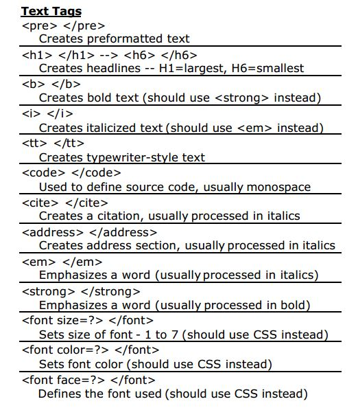

# Introduction to html, continued

Today we will talk about style in html documents. By the end of today you will learn how to work different sections of your HTML document, choose backgrounds, font colors, font types, etc. But before that let's do an exercise to refresh your mind on html and introduce new functionality.

### Activity 2-1

1. Open your code playground. You should be able to see your code from last session.

2. Take a look at the code here, and add it to your `<article>` element

```html
<div>
<ul>
  <li>First Pollutant</li>
  <li>Second Pollutant
    <ul>
      <li>Causes</li>
      <li>Effects</li>
    </ul>
  </li>
  <li>Third Pollutant</li>
</ul>
</div>
```

1. Each `<div>` element is a separate division in your HTML code. Later in this session we will se why it is important to divide your HTML document into distinct divisions using `<div>`

3. You just made your first **nested list**. These are great ways to represent data in a human accessible way. Take notice of what **tags** are used. Find where the **elements** are being opened and where they are being closed. Try to add a number of elements.

4. Fill your list with actual content. What pollutants do you think causs the most damage to your environment?

3. Add a *sub-element* after `"Causes"` and put one of the `Causes ` of the `Second Pollutant` in there.

4. Now we are going to make some stylistic modifications. Feel free to use your cheat sheet .



5. Use the `<strong>` or `<b>` tag to make the main categories **bold**. (`"First"`, `"Second"`, `"Third"`)

6. Use the `<em>` or `<i>`tag to turn the deepest sub-directories *italic*. (`"First, Second, First"`)

7. Use the `<font size=>` to change the size of one of the elements.

You can start to see the stylistic variations you can make for your reader. This is just the tip of the iceberg.


## Style and HTML

You can change a lot in terms of the style in a html document. You can already see what lays in the possibilities.

However, the way we have been doing these modifications seems to be highly inefficient. Imagine if you have lots of Heading 2s and you want to change their color all to `red`. Certainly it does not seem convenient to go around and add lots and lots of tags to change the color of each Heading to red.

There must be a way to control the stylistic organization of webpage.

Happily there are ways. With an external **stylesheet** we can give instructions to a computer on how to display the contents of a html document.

One of the solutions is to use **CSS** (**Cascading Style Sheets**).

You have already been using CSS. Let's now learn about it with an activity.

### Activity 2-3

1. Open your code from the last session. You had written a title for your page under the `<header>` tag with use of `<h1>` tag.

2. Now add the starter code here to the CSS section of your code playground. Remember not to change the rest of the CSS code.

```css
h1 {
  font-weight:normal;
  color: white;
  font-size: 40px;
  font-family: Courier;
  background-color: Green;
  text-align: center;
}
```

3. Do you see the result? Take a moment and try some variations to better understand how the CSS is changing the way the content of the HTML is represented.

4. Now try to make some difference on the appearance of your `<p>` elements. Maybe change the color, change the background and play with the alignment.

# Introduction to CSS

In the last activity you made your first CSS modifications. CSS is a programing language which is used to change the way a HTML document is represented in a web browser.

A good way to think about this is to imagine the HTML document as the skeleton of a webpage, and the CSS document as the appearance of the body. HTML is the *structural layer* and CSS is the *presentation layer*.


As it is illustrated above, CSS can turn your HTML into a wonderful web page.

In the last activity you used `h1{}` to change some stuff with the way the `<h1>` is presented in the HTML documented.

To understand CSS you need to understand what are `selectors` and `properties`


As you can see, we can generalize and say we can change properties of HTML tags through defining `selectors` in the CSS code and modifying some of the properties of the tag in that selector.
Take notice of the way we use `{`,`}`, and `;`. These are mandatory.

We introduce you to 4 ways you can take advantage of CSS powers:

1. You have already used the simple case use through the last activity. You can define a selector for a certain tag and change some of the properties.

2. You can instruct your machine to change some of the properties of a tag, only when the tag is used within a certain tag. Use this code below in your CSS:

```css
section > h2 {
  font-weight:bold;
  color: white;
  font-size: 30px;
  font-family: Courier;
  background-color: Red;
  text-align: center;
}
```

And now add a `<h2>` element to your `<section>` element. See the difference? `<h2>` does not behave the same in `<section>` and `<article>`.

3. You can define a new `id` and use it in your HTML code. Add this snippet to your CSS.

```css
#box1 {
  grid-area: f;
  background-color: Green;
  text-align: center;
}
```
Remember we put our nested list from the last activity into a `<div>` element?
Now change this line:

```html
<div>
```

To this:

```html
<div id="box1"><section>Box1</section>
```

Did you see what happened?
You told the computer to interpret this `<div>` element as a `box1` and it did so for you! Now try to make some more variations.

4. You can also define classes of things. Use this code below in your CSS:

```css
p.extrabig{
    font-weight:bold;
    font-size: 25px;
}
```

Now add a `<p class="extrabig>` element to your `<article>` element and write something. As you can see, you have changed some properties of the `<p>` element by defining a new `class` and redefining some the properties in there.

### Activity 2-2

1. By now you know a lot about CSS! Try to read the CSS code we have given your. You should be able to understand most of it. Discuss the code with your partners and fill free to ask about different parts of it from your instructor.

2. Your instructor should have some images ready for you. Get the links from your instructor and add the images to your `<section>` element. Take notice of how this element is of class `sidebar`.

3. We have created a number of boxes for you. Start add stuff to this boxes in your `<article>` element. Try to change some of the properties in different boxes. Maybe change the background in some of them, or change the color.
