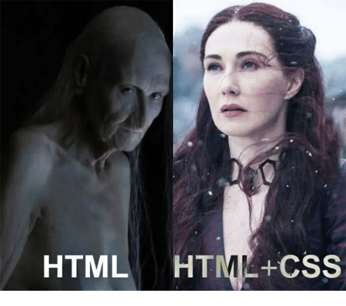

# Introduction to html, continued

Today we will talk about style in html documents. By the end of today you will learn how to choose backgrounds for your documents, font colors, font types, etc. But before that let's do an exercise to refresh your mind on html and introduce new functionality.

---
## Activity 2-1

1. Open your code playground. Start an instance of a html document, by defining the document type, start thing the **html element**, the **head element**, and the **body element**. Feel free to use the starter code from the last session. 

2. Take a look at the code here, and add it to your body element

```
<ul>
  <li>First</li>
  <li>Second
    <ul>
      <li>Second, First</li>
      <li>Second, Second</li>
    </ul>
  </li>
  <li>Third</li>
</ul>
```

3. You just made your first **nested list**. These are great ways to represent data in an human accessible way. Take notice of what **tags** are used. Find where the **elements** are being opened and where they are being closed. Try to add a number of elements. 

3. Add a *sub-element* after `"Second, First"` and put `"Second, First, First"` there.

4. Now we are going to make some stylistic modifications. Feel free to use your cheat sheet.


5. Use the `<strong>` tag to make the main categories **bold**. (`"First"`, `"Second"`, `"Third"`)

6. Use the `<em>` tag to turn the deepest sub-directories *italic*. (`"First, Second, First"`)

7. Use the `<font size=>` to change the size of one of the elements.

---

You can start to see the stylistic variations you can make for your reader. This is just the tip of the iceberg.


---
## Activity 2-2

1. Start a new html page. Define the elements and in body of the **body element** use `<h1>`, `<h2>`, `<h3>`, `<p>` and other tags as you wish to create the following memo.

2. Use `<h1>` and write `<YourName> Environmental Report`.

3. Write about the causes of pollution in your community and about ways you could think of a solution. Make sure you are writing your document in stylishly appealing order. Make sure to write your paragraphs in the body of **paragraph elements** (Use `<p>` tag)

4. Use the `<font color=blue>` to change the color of Heading 1. Don't forget to close the **font element** with a `</font>`

5. Use `<font size=?>` to change the size of your Heading 2s. You can use numbers `1 to 7` in place of `?`. Play around and see what happens. Don't forget to close your elements properly.

6. Be creative and make more stylistic modifications to your memo. Feel free to use the cheat sheet given to you. 

---

## Style and HTML

You can change a lot in terms of the style in a html document. You can already see what lays in the possibilities.

However, the way we have been doing these modifications seems to be highly inefficient. Imagine if you have lots of Heading 2s and you want to change their color all to `red`. Certainly it does not seem convenient to go around and add lots and lots of tags to change the color of each Heading to red.

There must be a way to control the stylistic organization of webpage.

Happily there are ways. With an external **stylesheet** we can give instructions to a computer on how to display the contents of a html document. 

One of the solutions is to use **CSS** (**Cascading Style Sheets**). 

Let's learn about CSS with an activity.

---

## Activity 2-3

1. Go back to your code editor. Delete all the stylistic modification you did on your memo from the previous activity. (Take your work to `Step 3, Activity 2-2`).

2. In the CSS section of the code playground add the following code.

```
h2 {
  font-weight:normal;
  color: white;
  font-size: 38px;
  font-family: Courier;
  background-color: black;
  text-align: center
}
```

3. Do you see the result? Take a moment and try some variations to better understand how the CSS is changing the way the content of the HTML is represented.

4. Now try to make some difference on the appearance of your `<p>` elements. Maybe change the color, change the background and play with the alignment.

5. Now Create an *ordered* list with the help of `<ul style="list-style-type:disc">` tag. You had seen something like this in the past when you used the `<font size=?>` tag. As you can see we can change properties of tags both externally, and externally within an html document.

---


# Introduction to CSS

In the last activity you made your first CSS document. CSS is a programing language which is used to change the way a HTML document is represented in a web browser.

A good way to think about this is to imagine the HTML document as the skeleton of a webpage, and the CSS document as the appearance of the body. HTML is the *structural layer* and CSS is the *presentation layer*.



As it is illustrated above, CSS can turn your HTML into a wonderful web page.

