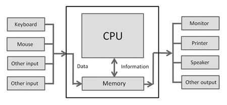

# Using This Page
- To see the slides [go here](/static/slides/01-computers.org)
- To learn more about computers, keep reading!

# How Computers Work

Computers machines that are **programmable**. This means:
- We can give them **instructions**
- They use those instructions to change **"inputs"** into **"outputs"** 

## Inputs and Outputs

Inputs can be:
-  a mouse, 
-  a keyboard, 
-  a camera

The computer cannot automatically act on those _inputs_ without help. You, the _human_ must give the computer specific instructions in order for it to know how to handle the information from those different sources in a way that produces results we can understand.

## Giving Instructions to Computers

We communicate with computers the same way we communicate with other as people-- we use **languages**!! However, just like with spoken languages, there are many different ones for computers.

> Hello, brothers and sisters
> नमस्कार, भाइबहिनीहरू
> 你好，兄弟姐妹

The first language is a good one for speaking to foreigners!

The second language is good for speaking to your friends!

The third one is probably not a good hcoice for someone to use with you! :smiley:

We use **programming languages** to define each and every step very carefully, computers follow those instructions to (hopefully) do what we want them to.

But we have to give them exactly the right instructions!

Say I want a Cola. Can I just ask my computer to get one for me? 

Imagine if you ask your friend to get a Cola for you. If your friend is nice enough to to it,, they will do many steps without yout explaining those steps to them. For example, they will do all this:

1. Put your jacket on
1. Put your shoes on
1. Tie your shoelaces
1. Open the door
1. Step outside
1. Close the door
1. Lock the door
1. Walk down the stairs to ground level
1. Walk to the grocery store
1. Buy a Cola
1. Walk back to you

And so on....

Your friend must perform lots and lots of small steps before they get the Cola to you. But you do not need to tell your friend each step. They are able to fill in the extra needed steps on their own. **Computers do not fill in missing instructions however**. You need to tell them every thing you want them to do. Sounds frustrating!

### Activity: Giving a Computer Instructions 🏃🏾‍♀️

Now it is **your turn**, imagine your instructor is a computer and you want them to open the door to this room.

How would you tell them to? In what order do you have to give them instructions?

## The Internet and the World Wide Web

In this workshop, we will teach you about the languages which will help you create your own web pages by telling the computer how you want it to look and what information it needs to have.

But before we do that, we should talk about what the **Internet** and  **World Wide Web** are as well as how the two are related but also a little different.

The **Internet** is a network or networks that connects millions of computers, mobile phones, and devices to each other so that they can all communicate. The **Web** is a virtual or _online_ space where information can be shared--often in the form of web sites, documents, and other resources--using the internet.

  <strong>🔖 Terms and Tools: The Web</strong> 
  According to Wikipedia, the largest open reference resource on the Internet, The <strong>World Wide Web (WWW)</strong>, also called the Web, is an information space where documents and other web resources are identified by Uniform Resource Locators (URLs), interlinked by hypertext links, and accessible via the Internet.

### Example: Talking to Your Friends on WhatsApp
For example, when someone sends message to their friend on WhatsApp using their mobile phone (which is really just a small computer/electronic device) they are using the **Internet** and the following happens:

1. Your phone connects to a computer *running* the "WhatsApp Server" that is connected to the Internet
1. After it connects, your phone sends the message along with information about who it is addressed to
1. The WhatsApp computer then looks for your friend's phone
1. If they can connect to your friend's phone, then the message is sent and removed from the WhatsApp computer
1. The WhatsApp computer then tells your phone that the message was sent and received ✔️✔️

This is just a start of one interaction on the Internet, but we now know a little bit about the Internet. It is time to create our own web-pages now!

