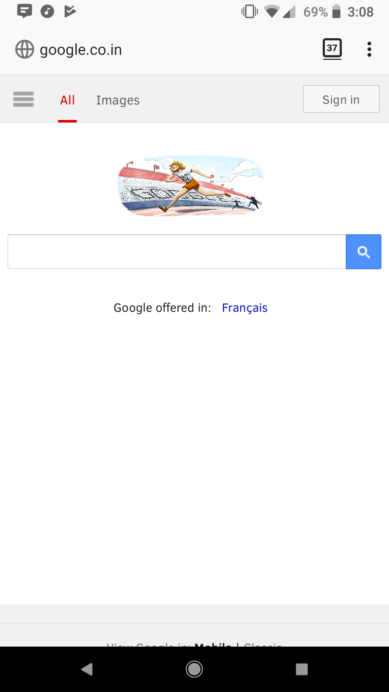
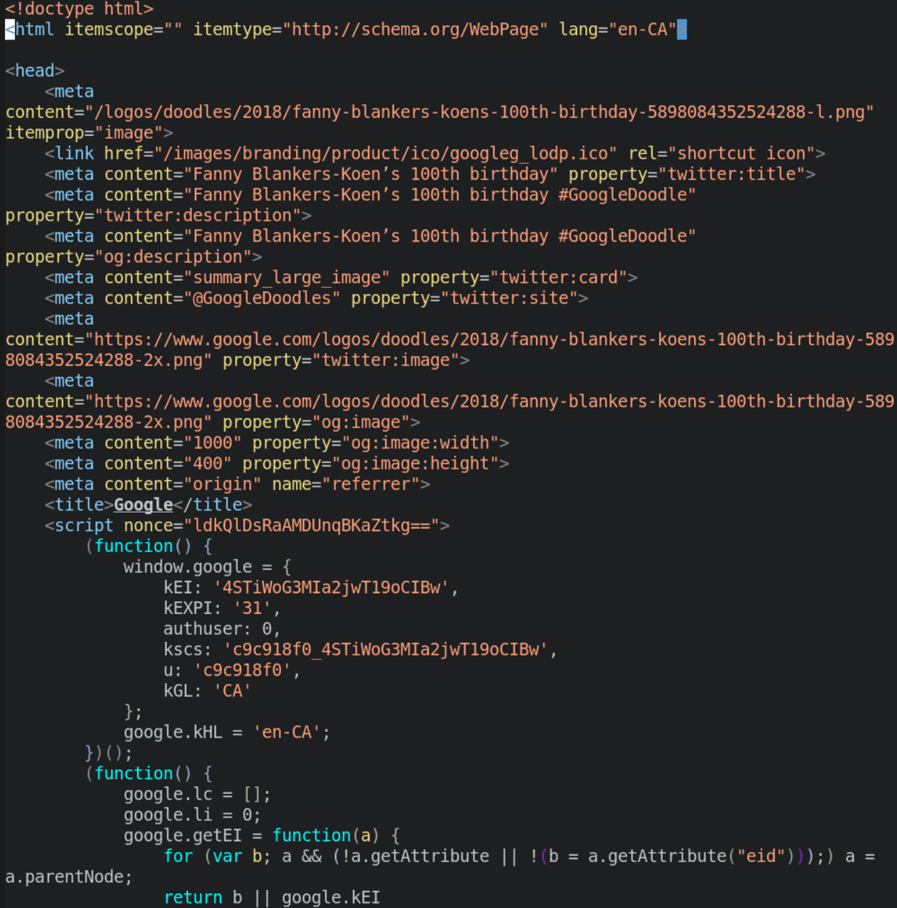

**[TODO: write some intro? (if no table of contents then YES)]**

# How Computers Work

Computers machines that are programmable--they are devices, often powered by electricity, that can accept instructions and information as _inputs_, carry out those instructions or series of operations on _inputs_, and provide the results as _outputs_.

##### *What does that mean?*


Computers receive information from different sources: a mouse, a keyboard, a camera, and more, but they are not able to automatically act on those _inputs_ without help. You, the _human_ must give the computer specific instructions in order for it to know how to handle the information from those different sources in a way that produces results we can understand.

## Giving Instructions to Computers


We communicate with computers the same way we communicate with other as people-- we use **languages**!! However, just like with spoken languages, there are many different ones for computers.

> Hello, brothers and sisters
> नमस्कार, भाइबहिनीहरू
> 你好，兄弟姐妹

We use **programming languages** to define each and every step very carefully, computers follow those instructions to (hopefully) do what we want them to.

So is it as easy as telling computers what we want them to do for us, and then they do it?

Well, yes... and no! Like we mentioned above, there are lots of languages, so you have to be speaking the right one for the type of task you want to accomplish, also, computers are very literal, they do not always understand instructions or can require very specific instructions that are difficult to fully plan.

Say I want an ice cream, can I just ask my computer to get one for me? Well, yes... and no!

Imagine if you ask your friend to get ice cream for you. If your friend is nice enough to get ice cream for you, they will do all the steps in between the goal of getting an ice cream without you having to tell them what to do. For example, they will do the following without you having to tell them about it:

1. Put your jacket on
1. Put your shoes on
1. Tie your shoelaces
1. Open the door
1. Step outside
1. Close the door
1. Lock the door
1. Walk down the stairs to ground level
1. Walk to the grocery store
1. Buy an ice cream cone
1. Walk back to you

And so on....

Your friend must perform lots and lots of small steps before they get an ice cream to you. But you do not need to tell your friend each step, they are able to fill in the extra needed steps on their own. **Computers do not fill in missing instructions however**. You need to tell them every thing you want them to do. Sounds frustrating!

### Activity: Giving a Computer Instructions 🏃🏾‍♀️

Now it is **your turn**, imagine your instructor is a computer and you want them to open the door to this room.

How would you tell them to? In what order do you have to give them instructions?

## The Internet and the World Wide Web

In this workshop, we will teach you about the languages which will help you create your own web pages by telling the computer how you want it to look and what information it needs to have.

But before we do that, we should talk about what the **Internet** and  **World Wide Web** are as well as how the two are related but also a little different.

The **Internet** is a network or networks that connects millions of computers, mobile phones, and devices to each other so that they can all communicate. The **Web** is a virtual or _online_ space where information can be shared--often in the form of web sites, documents, and other resources--using the internet.

<div class="alert alert-info">
  <strong>🔖 Terms and Tools: The Web</strong><br />
  According to Wikipedia, the largest open reference resource on the Internet, The <strong>World Wide Web (WWW)</strong>, also called the Web, is an information space where documents and other web resources are identified by Uniform Resource Locators (URLs), interlinked by hypertext links, and accessible via the Internet.
</div>

For example, when someone sends message to their friend on WhatsApp using their mobile phone (which is really just a small computer/electronic device) they are using the **Internet** and the following happens:

1. Your device connects to a computer *running* the WhatsApp message queue that is connected to the Internet
1. If they are able to connect, your device sends the message along with information about who it is addressed to
1. The WhatsApp computer then tries to connect to the message recipient
1. If they can connect to the recipient's device, then the message is sent and removed from the WhatsApp computer
1. The WhatsApp computer then lets your device know that the message was sent (and in some cases, that it was successfully received ✔️✔️)


This is just a start of one interaction on the Internet, but we now know a little bit about Internet. It is time to create our own web-pages now!

## Webpages and Computer Languages

When you go to Google's website, you see this:



But what the computer sees is this:



This language, called HTML or Hypertext Markup Language, is the language of web pages. Taken together with two other languages, CSS or Cascading Style Sheets, and JavaScript, it forms part of the technologies that power the Web.

If we want to make our own web pages, we have write out our instructions about what we want using the language that the computer can understand--and that is what we will be learning about this week!

# Building Blocks of HTML

## Activity: Creating your first site 💻

Sometimes it helps to just start building!

1. On your computer, open the [**code playground**](#). You can do this by clicking the link, or clicking the "Code Playground" link on the top right of the this web site

<div class="alert alert-info">
  <strong>🔖 Terms and Tools: Code Playground</strong><br />
  A <strong>code playground</strong> is a live environment where you can type out your code and see the results in real time. The code playground always watches the changes you are making and then reloads just the section of the page that shows the "finished" result.
</div>

2. In the HTML tab of your code playgroung, paste the following:

```html
<!DOCTYPE html>
<html>
<head>
  <meta charset="utf-8">
  <title>Title</title>
</head>
<body>

  <h1>My favourite foods</h1>
  <p>I like to eat...</p>

</body>
</html>
```

3. In your code playground, try making changes to the HTML where you see "...". Pay attention to what happens to the resulting web page when you make certain changes to the code

<div class="alert alert-success">
  <h4>🎉🎊🎉 Congratulations, you just made your first web page! 🎉🎊🎉</h4>
</div>

Now, to go back and talk through what made it possible to make that page.

## Tags

The two core parts of HTML are **elements** which are created using **tags** in order to describe and structure content!

**Tags** specify where elements start and where they end. All tags start with a `<` left angle bracket and end with a `>` right angle bracket.

For example in the HTML code above `<!DOCTYPE>`, `<html>`, and `</html>` are some of the tags we can see.

### Activity: Locate the tags 💻

Try to find more tags **tags** in the HMTL code above with your fellow students.

Now that we can identify tags, let's describe the code above to understand what we did there:

* The `<!DOCTYPE html>` declares that this document is a html document
* `<html>` and `</html>` mark the beginning and the end of the **HTML element**. Everything else is nested underneath!

## Elements

A html document consists of **elements**. The body that goes between a start tag and an end tag is called an **element** in html. For example, the **HTML element** in the code above consists of everything from the start tag `<html>` to the end tag `</html>`

### Activity: Locate the elements 💻

1. Try to find the rest of the **elements** with your fellow students.

You can review some of the most important html tags <a href="htmlcheatsheet.pdf">here </a>. The document is from the Stanford University.

- **Start tag** `<head>` starts the *head element* and `</head>` ends it
- The title of the web page between `<title>` and `</title>` tags
- The main part of the page (the *body element*) goes between `<body>` and `</body>`
- `<h1>` and `</h1>` indicate what goes between is a header
- `<p>` and `</p>` mark the beginning and end of a paragraph element

### Activity: Changing the look of text 💻

If you have some special text you want to add emphasis to there are a few common ways you can!

- `<strong></strong>` makes text **bold**
- `<em></em>` makes text *italic*
- `<mark></mark>` <mark>highlights</mark> text

**Your turn**:

- Can you <mark>highlight</mark> your favourite dish on the list?
- Can you make all the Holiday names **bold** and foods *italic*?

### Activity: Making a list of holiday foods 💻

Now we will add some more information to your site. If we want to list a lot of items, or list a series of steps to take in order, we can use another element for those! A **list**!

1. In the HTML tab of your code playground, paste or type the following in the `body` of your site under the `h1` and `p` elements
  ```html
  <ul>
    <li>Holiday Name
      <ul>
        <li>Dish 1</li>
        <li>Dish 2</li>
      </ul>
    </li>
    <li>Holiday Name
      <ul>
        <li>Dish 1</li>
        <li>Dish 2</li>
      </ul>
    </li>
    <li>Holiday Name</li>
  </ul>
  ```

1. Can you fill it in with your favourite holidays and some of the food you like to eat? Here is a Canadian example:
  ```html
  <ul>
    <li>Canadian Thanksgiving
      <ul>
        <li>Pumpkin Pie</li>
        <li>Mashed Potatoes</li>
        <li>Tossed Salad</li>
        <li>...</li>
      </ul>
    </li>
  </ul>
  ```
  - Canadian Thanksgiving
      - Pumpkin Pie
      - Mashed Potatoes
      - Tossed Salad
      - ...

You just made an **list** that have a few lists **nested** inside it!

There are different types of lists!

- Pumpkin Pie
- Mashed Potatoes
- Tossed Salad

1. Put your jacket on
1. Put your shoes on
1. Tie your shoelaces

For **unordered lists** we use the `<ul></ul>` tags and each list item starts with `<li>`. **Ordered lists** we use the `<ol></ol>` tags, and each list item still starts with `<li>`.

**Your turn**:

- Can you make a new list with the order of your favourite foods from above?

## Parts of a Web Page

A web page often has many separate parts it can be logically seperated into. To help make web pages easier to build, people use elements to identify these seperate **sections** and create a broad outline, kind of like how you would a document on paper.

Some of the most frequently used sections, also in the image below, are:

`<article>`
`<aside>`
`<header>`
`<footer>`
`<h1>` through `<h6>`
`<nav>`
`<section>`

The image below identify some of the most important of these separate sections, can you guess what they do?


Each of these tags define an independent `element` in the HTML document.
These elements are *semantic* because the tag also defines the function of their content in the document.

Think about is this way:

- The content of the walls of your class room (stuff like pictures, graphs, etc.) are in the *semantic element* of `<wall>`
- What is on the ground of your classroom (stuff like your chairs, desks, etc.) are in the *semantic element* of `<ground>`
- What is on your desks (stuff like your monitor, mouse, keyboard, etc.) are in the *semantic element* of <desk>`

Let's do an activity to practice using these tags!

### Activity: Classroom Tags 🏃🏾‍♀️

**[TODO: write some aspect of this here]**


<div class="alert alert-success">
  <h4>🎉🎊🎉 You finished the first class! 🎉🎊🎉</h4>
</div>

You now know about computers, programming languages and the Internet. You also have begun your journey into web development by taking your first steps into the realm of HTML.
