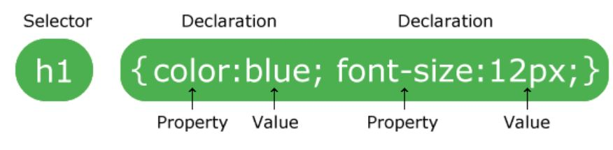

# Adding Style with CSS

Today we will talk about how to add ✨ style ✨ to your web sites. By the end of the class you will know how to:

- change the colour and font of text
- change the background colour
- recognize the different sections of your web site


Before that let's review what we did yesterday! Also, let's learn some new HTML that you didn't get to practice in your first class. Then we'll go on to CSS!

## Review: Parts of a web page and styling text

1. Open your code playground. You should be able to see your code from last session, if not, you can use this:
    ```html
    <!DOCTYPE html>
    <html>
    <head>
      <meta charset="utf-8">
      <title>Favourite foods</title>
      <link href="/offline/unpkg.com/chota.css" rel="stylesheet" type="text/css" />

    </head>
    <body>

      <h1>My favourite foods</h1>
      <p>I like to eat...</p>

      <p>During the holidays these are my favourite dishes:</p>

      <ul>
      <li>First Holiday
        <ul>
          <li>Dish 1</li>
          <li>Dish 2</li>
        </ul>
      </li>
      <li>Second Holiday
        <ul>
          <li>Dish 1</li>
          <li>Dish 2</li>
        </ul>
      </li>
      <li>Third Holiday</li>
      </ul>

      <h1>Ranked list of my favourite foods</h1>
      <ol>
        <li>Dish name</li>
        <li>Dish name</li>
        <li>Dish name</li>
        <li>Dish name</li>
      </ol>

    </body>
    </html>
    ```
  **Your turn**:
  
    - Can you <mark>highlight</mark> your **least** favourite dish on the list?
    - Can you make all the Holiday names *italic*?


## Extra HTML: Parts of a Web Page

Like you, a web page has many parts: a `<head>` and a `<body>`, and all the pieces inside.  When we make a web page, we usually start by buiding a **skeleton**. We make the **shape** of the web page out of empty elements, and we fill in the **content** of the page afterwards. 

We use special tags to build the skeleton. They tell the computer what part of the page is inside them. In these lessons, we will use these tags to help "structure" the web page:

- `<h1>`, `<h2>`, and `<h3>` : these tags make "headings" -- `h1` is the biggest, and `h3` is smaller
- `<header>`: We use this for content that goes at the top of the page, like the title, and sometimes also certain links. 
- `<nav>`: the nav is usally inside or right after the `header` tag. It helps your users to "navigate" your page.
- `<main>` : we put most of the content in our pages inside the `main` tag
- `<article>`and `<section>`: we use these for parts of the main content
- `<aside>`: we use `aside` when we havewritten something that is not part of the main story we aretelling, but is somehow related. We use asides the way we sometimes use smaller boxes in a poster. 
- `<footer>`: this is for content that you want to put at the bottom of your web page. 

This picture shows how you might make a web page out of these "structural" tags


<div class="alert alert-info">
  <strong>🔖 Terms and Tools: "Semantic" Tags</strong><br />
  We call these tags <strong>"semantic"</strong> because the name of the tag also defines the **function** of the content inside of the web page. "Semantic" is a compliated word, and you don't need to use it; but you might see other people use it when you are exploring the Internet.
</div>


Let's do an activity to practice using these tags!

### Activity: Classroom Tags 🏃🏾‍♀️

A web page has **structure**, just like a human body, or an automobile, or a house. It works best when the pieces of the structure are put together in the right order.  Your classroom has a "structure" too. Let's build a model of the classroom using tags! You can do ths however you want, but here are some ideas: 

- The content of the walls of your class room (stuff like pictures, graphs, etc.) could be in the *element* of `<wall>`
- What is on the ground of your classroom (stuff like your chairs, desks, etc.) could be in the *semantic element* of `<ground>`
- What is on your desks (stuff like your monitor, mouse, keyboard, etc.) could be in the *semantic element* of <desk>`


### Activity 1 💻

1. Open [style file](style.css) and copy its content into the CSS section of your code playground.

  CSS stands for **Cascading Style Sheets** and is a way to change the colour and fonts on your web pages as well as everything else about how they look, we'll learn more about this in a little bit!

2. For now, copy the code below in the HTML section of your code playground

  ```html
  <!DOCTYPE html>
  <html>
    <head>
      <meta charset="utf-8" />
      <link href="style.css" rel="stylesheet"/>
      <title></title>
    </head>
    <body>
      <main>
        <header>

        </header>

        <nav>
        </nav>

        <section class="sidebar">
        </section>

        <article>
          <p>
          </p>
        </article>

        <aside>

        </aside>
      </main>
    </body>
  </html>
  ```

3. Write a short paragraph with a headline about your favourite foods and your school in `<article>`. Make sure to use the `<p>` and `<h2>` tags.

4. Use `<h1>` and write a title for your document in `<header>` element.

5. You can draw attention to text in a couple ways:
  `<strong>important</strong>` to show text is **important**
  `<em>emphasize</em>` to *emphasize* text similar to how you speak

6. Keep playing with this template. You should be able to understand what purpose each of the tags play in the presentation of the document.

7. Your instructor should provide you with links to some images. Use the snippet code below to add pictures to your `<section>` element.

```html

```


## Style and HTML

You can change a lot in terms of the style in a html document. You can already see what lays in the possibilities.

However, the way we have been doing these modifications seems to be highly inefficient. Imagine if you have lots of Heading 2s and you want to change their color all to `red`. Certainly it does not seem convenient to go around and add lots and lots of tags to change the color of each Heading to red.

There must be a way to control the stylistic organization of web page.

Happily there are ways. With an external **stylesheet** we can give instructions to a computer on how to display the contents of a html document.

One of the solutions is to use **CSS** (**Cascading Style Sheets**).

You have already been using CSS. Let's now learn about it with an activity.

### Activity 2 💻

1. Open your code from the last session. You had written a title for your page under the `<header>` tag with use of `<h1>` tag.

2. Now add the starter code here to the CSS section of your code playground. Remember not to change the rest of the CSS code.

```css
h1 {
  font-weight:normal;
  color: white;
  font-size: 40px;
  font-family: Courier;
  background-color: green;
  text-align: center;
}
```

3. Do you see the result? Take a moment and try some variations to better understand how the CSS is changing the way the content of the HTML is represented.

4. Now try to make some difference on the appearance of your `<p>` elements. Try changing the color, the background and the alignment.

# Introduction to CSS

In the last activity you made your first CSS modifications. CSS is a programming language which is used to change the way a HTML document is represented in a web browser.

A good way to think about this is to imagine the HTML document as the skeleton of a web page, and the CSS document as the appearance of the body. HTML is the *structural layer* and CSS is the *presentation layer*.

As it is illustrated above, CSS can turn your HTML into a wonderful web page.

In the last activity you used `h1{}` to change some stuff with the way the `<h1>` is presented in the HTML documented.

To understand CSS you need to understand what are `selectors` and `properties`



As you can see, we can generalize and say we can change properties of HTML tags through defining `selectors` in the CSS code and modifying some of the properties of the tag in that selector.
Take notice of the way we use `{`,`}`, and `;`. These are mandatory.

We introduce you to 4 ways you can take advantage of CSS powers:

1. You have already used the simple case use through the last activity. You can define a selector for a certain tag and change some of the properties.

1. You can instruct your machine to change some of the properties of a tag, only when the tag is used within a certain tag. Use this code below in your CSS:
  ```css
  section > h2 {
    font-weight:bold;
    color: white;
    font-size: 30px;
    font-family: Courier;
    background-color: Red;
    text-align: center;
  }
  ```
  Now add a `<h2>` element to your `<section>` element. See the difference? `<h2>` does not behave the same in `<section>` and `<article>`.

1. You can define a new `id` and use it in your HTML code. Add this snippet to your CSS.
  ```css
  #box1 {
    grid-area: f;
    background-color: Green;
    text-align: center;
  }
  ```
  Remember we put our nested list from the last activity into a `<div>` element?

1. Now change this line:
  ```html
  <div>
  ```
  To this:
  ```html
  <div id="box1"><section>Box1</section>
  ```

Did you see what happened?
You told the computer to interpret this `<div>` element as a `box1` and it did so for you! Now try to make some more variations.

1. You can also define classes of things. Use this code below in your CSS:
  ```css
  p.extrabig {
      font-weight:bold;
      font-size: 25px;
  }
  ```
  Now add a `<p class="extrabig>` element to your `<article>` element and write something. As you can see, you have changed some properties of the `<p>` element by defining a new `class` and redefining some the properties in there.

### Activity 3 💻

1. By now you know a lot about CSS! Try to read the CSS code we have given you. Discuss the code with your partners and fill free to ask about different parts of it from your instructor.

2. Your instructor should have some images ready for you. Get the links from your instructor and add the images to your `<section>` element. Take notice of how this element is of class `sidebar`.

3. We have created a number of boxes for you. Start add stuff to this boxes in your `<article>` element. Try to change some of the properties in different boxes. Maybe change the background in some of them, or change the color.
